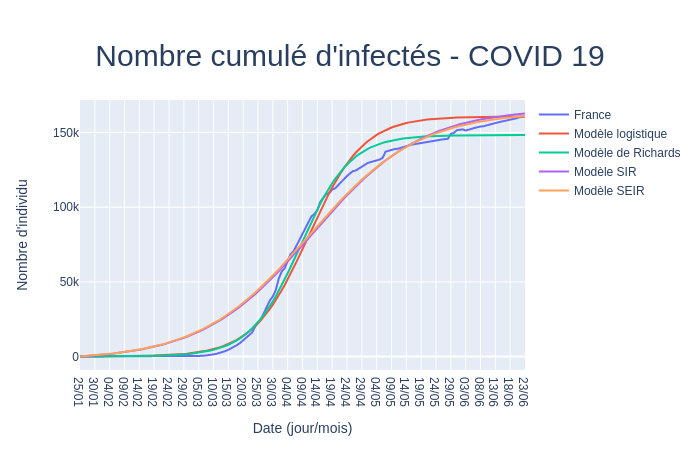
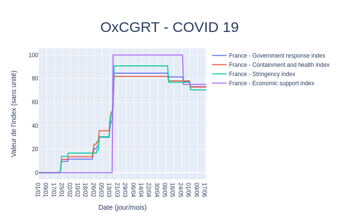

# Seegmuller_Stage_AMSE

## Description

L'objectif est de savoir s'il on peut observer des liens entre les données du COVID 19 (nombre de cas, nombre de déces...) et les indices de https://github.com/OxCGRT/covid-policy-tracker.

## Arborescence

| Fichier | Contenu | Type |
| :-----: | :-----: | :-----: |
|   |   |   | 
| models.py | Toutes les fonctions utilisées pour calculer les modèles | Pack de fonctions |
| useful_fcts.py | Fonctions utiles | Pack de fonctions |
|   |   |   |
| data.py | Données du COVID 19 | Données |
|   |   |   |
| models_interractive.py | Représentation du nombre cumulatif d'infectés de la COVID 19 en France et des différents modèles avec coefficients optimisés | Exécutable |
| OxCGRT.py | Représentation des indicateurs politiques | Exécutable |
| CC_display.py | Représentation du nombre cumulatif d'infectés de la COVID 19 dans le monde | Exécutable |
| CC_comparator.py | Outil de comparaison du nombre cumulatif d'infectés de la COVID 19 dans le monde | Exécutable |
| CDeath_comparator.py | Outil de comparaison du nombre cumulatif de décès de la COVID 19 dans le monde | Exécutable |
| Death_comparator.py | Outil de comparaison du nombre de décès de la COVID 19 dans le monde | Exécutable |

## models_interractive.py

### Appel :
  `python models_interractive.py`
  - cliquer sur le lien
 
### Exemple de résultat :

## OxCGRT.py

### Appel :
  `python OxCGRT.py`
  - cliquer sur le lien
 
### Exemple de résultat :

