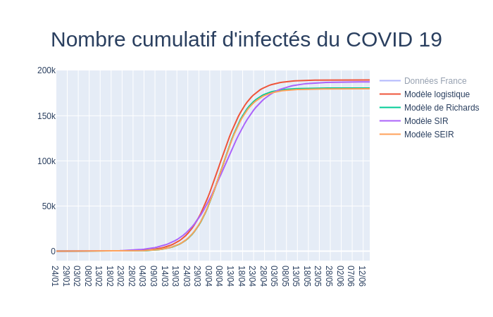

# Seegmuller_Stage_AMSE

## Arborescence

| Fichier | Contenu | Type |
| :-----: | :-----: | :-----: |
|   |   |   | 
| models.py | Toutes les fonctions utilisées pour calculer les modèles | Pack de fonctions |
| models_interractive.py | Représentation du nombre cumulatif d'infectés du COVID 19 en France et des différents modèles avec coefficients optimisés | Exécutable |
| data.py | Données du COVID 19 | Données |
| OxCGRT.py | Représentation des indicateurs politiques | Exécutable |
| useful_fcts.py | Fonctions utiles | Pack de fonctions |
| figure_creator.py | Création de figure pour OxCGRT.py | Fonction |
| min_logistique.py | Optimisation des coefficients du modèle logistique | Exécutable |
| min_richards.py | Optimisation des coefficients du modèle de Richards | Exécutable |
| min_SIR.py | Optimisation des coefficients du modèle SIR | Exécutable |
| min_SEIR.py | Optimisation des coefficients du modèle SEIR | Exécutable |

## models_interractive.py

### Appel :
  `python models_interractive.py`
  - cliquer sur le lien
 
### Exemple de résultat :

## OxCGRT.py

### Appel :
  `python OxCGRT.py`
  - cliquer sur le lien
 
### Exemple de résultat :
